# CXT Architecture

```mermaid
flowchart TD
    %% ─── Entry Point ───
    subgraph ENTRY["Entry Point"]
        main["main.rs\n─────────────\nParse CLI args\nRoute to mode\nPrint summary"]
    end

    %% ─── CLI ───
    subgraph CLI_LAYER["CLI Layer"]
        args["cli.rs · Args (flattened)\n──────────────────────────────\nSourceArgs: tui, df, st\nSelectArgs: ignore, ext, lang,\n  hidden, no_sort\nRenderArgs: relative, no_path,\n  format\nOutputArgs: print, write,\n  compress, ci\nEnums: PathHeader, Destination,\n  Mode\nAccessors: mode(), validate(),\n  header(), destination()"]
    end

    %% ─── Modes ───
    subgraph MODES["Input Modes"]
        tui_mode["TUI Mode\n─────────\n--tui flag\nor no args"]
        git_mode["Git Mode\n──────────\n--df / --st\ngit diff/status"]
        cli_mode["CLI Mode\n──────────\nexplicit paths\nor stdin pipe"]
    end

    %% ─── TUI Subsystem ───
    subgraph TUI["TUI Subsystem  (src/tui/)"]
        tui_mod["mod.rs\n──────────────────\nInit crossterm terminal\nEvent loop\nSession cache\n($XDG_RUNTIME_DIR/\n cxt_last_selection)"]

        app["app.rs · AppState\n──────────────────────\nroot_dir: PathBuf\ntree_state: TreeState\ndir_cache: HashMap\nselected: HashSet\nmode: AppMode\nsearch_query: String\nsearch_results: Vec\ngit_commits: Vec\ngit_diff_content: String\ngit_diff_cache: HashMap"]

        events["events.rs\n──────────────────────\nhandle_normal()\nhandle_search_focused()\nhandle_search_navigating()\nhandle_git_tree()\nMouse + keyboard dispatch"]

        render["render.rs\n──────────────────────\nFile tree widget\nSearch results list\nGit panel + diff view\nStatus bar\nHelp overlay"]

        theme["theme.rs\nColor/style defs"]

        app_mode["AppMode (enum)\n──────────────\nNormal\nSearchFocused\nSearchNavigating\nGitTree"]
    end

    %% ─── Core Processing ───
    subgraph CORE["Core Processing"]
        agg["content_aggregator.rs\n · ContentAggregator\n──────────────────────────\naggregate_paths()\naggregate_directory()\nParallel walk (rayon)\nBinary detection\nExtension filtering\nToken counting\nGitignore respect"]

        notebook["notebook.rs\n─────────────────\nextract_notebook_code()\nParse nbformat 2/3/4+\nExtract code cells only\nFallback for >50 MB"]

        image_h["image_handler.rs\n──────────────────\ncopy_image_to_clipboard()\nDecode any format\nRe-encode to PNG\nSingle-image validation"]

        token["token_counter.rs\n · TokenCounter\n──────────────────\nBPE via tiktoken-rs\nEstimate for >5 MB\nformat_count()"]

        lang["lang.rs · LangDef\n──────────────────\n35+ languages\nAliases → extensions\nbuild_extension_filter()\nfind(), all_names()"]
    end

    %% ─── Formatting ───
    subgraph FMT["Formatting Layer"]
        formatter["formatter.rs\n · Formatter trait\n──────────────────\nXmlFormatter\nMarkdownFormatter\ndoc_start/end\nfile_header/footer\nlanguage_for_extension()"]
    end

    %% ─── Output ───
    subgraph OUTPUT["Output Layer"]
        out_handler["output_handler.rs\n · OutputHandler\n──────────────────────\nbuild_backend_chain()\nget_clipboard_writer()\nPlatform detection:\n  WAYLAND_DISPLAY\n  XDG_SESSION_TYPE\n  WSL_DISTRO_NAME\n  DISPLAY"]

        clip_writer["clipboard.rs\n · ClipboardWriter\n──────────────────\nwriter: Box<Write>\nbackend: Box<Backend>\nfinish() → flush"]

        subgraph BACKENDS["Clipboard Backends  (ClipboardBackend trait)"]
            wlcopy["WlCopyBackend\n(wl-copy · Wayland)"]
            x11["X11Backend\n(xclip · X11)"]
            pbcopy["PbcopyBackend\n(pbcopy · macOS)"]
            wsl["WslBackend\n(clip.exe · WSL)"]
            arboard["ArboardBackend\n(universal fallback)"]
            named["NamedProcessBackend\n(copyq · clipman\n cliphist · gpaste\n clipse)"]
        end
    end

    %% ─── Output Destinations ───
    subgraph DEST["Output Destinations"]
        clipboard["System Clipboard"]
        file_out["File  (--write)\nor .gz (--compress)"]
        stdout["Stdout  (--print)\nor /dev/null (--ci)"]
    end

    %% ─── External Libraries ───
    subgraph LIBS["Key External Libraries"]
        ignore_lib["ignore\nGitignore + parallel walk"]
        rayon_lib["rayon\nParallel file I/O"]
        ratatui_lib["ratatui + crossterm\nTUI rendering"]
        fuzzy_lib["fuzzy-matcher\nSkim algorithm search"]
        tiktoken_lib["tiktoken-rs\nBPE token counting"]
        serde_lib["serde_json\nNotebook parsing"]
        image_lib["image\nDecode/encode images"]
        bracoxide_lib["bracoxide\nBrace expansion"]
        flate2_lib["flate2\nGzip compression"]
    end

    %% ─── Connections: Entry → CLI ───
    main -->|"reads"| args
    args -->|"--tui / no args"| tui_mode
    args -->|"--df / --st"| git_mode
    args -->|"paths / stdin"| cli_mode

    %% ─── TUI internal ───
    tui_mode --> tui_mod
    tui_mod <-->|"state"| app
    tui_mod -->|"events"| events
    tui_mod -->|"render"| render
    events -->|"mutates"| app
    render -->|"reads"| app
    app -->|"current mode"| app_mode
    render --- theme

    %% ─── TUI → Core ───
    tui_mod -->|"selected paths"| cli_mode

    %% ─── Git mode ───
    git_mode -->|"git subprocess"| agg

    %% ─── CLI → Core ───
    cli_mode -->|"paths list"| agg

    %% ─── Core internals ───
    agg -->|".ipynb files"| notebook
    agg -->|"image files"| image_h
    agg -->|"byte counts"| token
    agg -->|"--lang / --ext"| lang
    lang -->|"extension set"| agg
    token -->|"token counts"| agg

    %% ─── Core → Formatting ───
    agg -->|"write content"| formatter

    %% ─── Formatting → Output ───
    formatter -->|"formatted stream"| out_handler
    out_handler -->|"selects backend"| clip_writer
    clip_writer --> wlcopy
    clip_writer --> x11
    clip_writer --> pbcopy
    clip_writer --> wsl
    clip_writer --> arboard
    clip_writer --> named

    %% ─── Output → Destinations ───
    wlcopy --> clipboard
    x11 --> clipboard
    pbcopy --> clipboard
    wsl --> clipboard
    arboard --> clipboard
    named --> clipboard
    image_h -->|"PNG bytes"| clipboard
    out_handler -->|"--write"| file_out
    out_handler -->|"--print"| stdout

    %% ─── Library bindings ───
    agg -.->|"uses"| ignore_lib
    agg -.->|"uses"| rayon_lib
    tui_mod -.->|"uses"| ratatui_lib
    app -.->|"uses"| fuzzy_lib
    token -.->|"uses"| tiktoken_lib
    notebook -.->|"uses"| serde_lib
    image_h -.->|"uses"| image_lib
    main -.->|"uses"| bracoxide_lib
    out_handler -.->|"uses"| flate2_lib

    %% ─── Styles ───
    classDef entry    fill:#1a1a2e,stroke:#e94560,color:#fff,font-weight:bold
    classDef layer    fill:#16213e,stroke:#0f3460,color:#a8d8ea
    classDef core     fill:#0f3460,stroke:#533483,color:#e2e2e2
    classDef tui      fill:#533483,stroke:#e94560,color:#fff
    classDef output   fill:#065535,stroke:#0a9152,color:#d4edda
    classDef backend  fill:#002b1d,stroke:#0a9152,color:#69f0ae
    classDef dest     fill:#1a0a00,stroke:#ff6600,color:#ffd180
    classDef lib      fill:#1a1a1a,stroke:#555,color:#aaa,font-style:italic

    class main entry
    class args layer
    class tui_mode,git_mode,cli_mode layer
    class tui_mod,app,events,render,theme,app_mode tui
    class agg,notebook,image_h,token,lang core
    class formatter core
    class out_handler,clip_writer output
    class wlcopy,x11,pbcopy,wsl,arboard,named backend
    class clipboard,file_out,stdout dest
    class ignore_lib,rayon_lib,ratatui_lib,fuzzy_lib,tiktoken_lib,serde_lib,image_lib,bracoxide_lib,flate2_lib lib
```



## Module Summary

| Module | File | Responsibility |
|--------|------|---------------|
| **CLI Args** | `cli.rs` | `Args` flattened into `SourceArgs`, `SelectArgs`, `RenderArgs`, `OutputArgs`; enums `PathHeader`, `Destination`, `Mode`; accessors `mode()`, `header()`, `destination()` |
| **Main** | `main.rs` | Entry point, routing, brace expansion, summary output |
| **Content Aggregator** | `content_aggregator.rs` | Parallel file walking, binary detection, aggregation |
| **Formatter** | `formatter.rs` | XML or Markdown output formatting (trait + two impls); `build_formatter(choice, PathHeader)` |
| **Token Counter** | `token_counter.rs` | BPE tokenization via `tiktoken-rs`, with estimation fallback |
| **Language Defs** | `lang.rs` | 35+ language → extension mappings for `--lang` filtering |
| **Notebook Handler** | `notebook.rs` | Jupyter `.ipynb` code-cell extraction (nbformat 2–4) |
| **Image Handler** | `image_handler.rs` | Decode any image format, re-encode to PNG for clipboard |
| **Output Handler** | `output_handler.rs` | Platform detection, backend chain assembly; `impl Destination { write_with, requires_clipboard }` owns TeeWriter, GzEncoder, and clipboard finish |
| **Clipboard** | `clipboard.rs` | `ClipboardBackend` trait + all platform implementations |
| **TUI mod** | `tui/mod.rs` | Terminal init, main event loop, session cache |
| **TUI App State** | `tui/app.rs` | `AppState` struct, directory lazy-loading, git integration |
| **TUI Events** | `tui/events.rs` | Keyboard/mouse dispatch per `AppMode` |
| **TUI Render** | `tui/render.rs` | `ratatui` widget composition and layout |
| **TUI Theme** | `tui/theme.rs` | Color and style constants |

## Data Flow Summary

```
User Input (CLI args / TUI selection)
    │
    ▼
main.rs  ──routes──▶  ContentAggregator
                            │
                   ┌────────┴────────┐
                   ▼                 ▼
            Formatter           TokenCounter
           (XML / MD)        (BPE / estimate)
                   │
                   ▼
            OutputHandler
            (detect platform)
                   │
                   ▼
          ClipboardBackend
      (wl-copy / pbcopy / arboard / …)
                   │
                   ▼
        System Clipboard / File / Stdout
```
